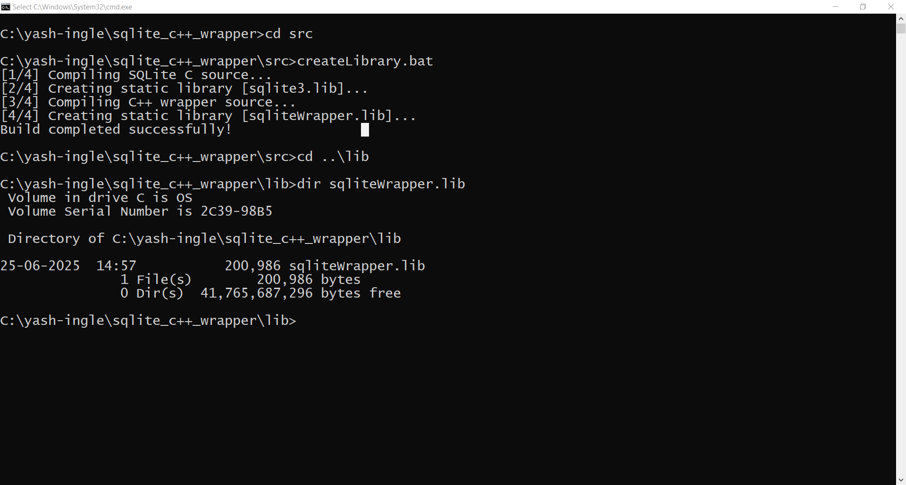
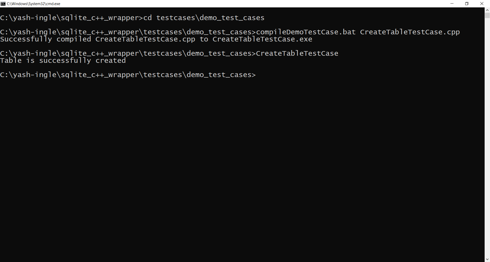
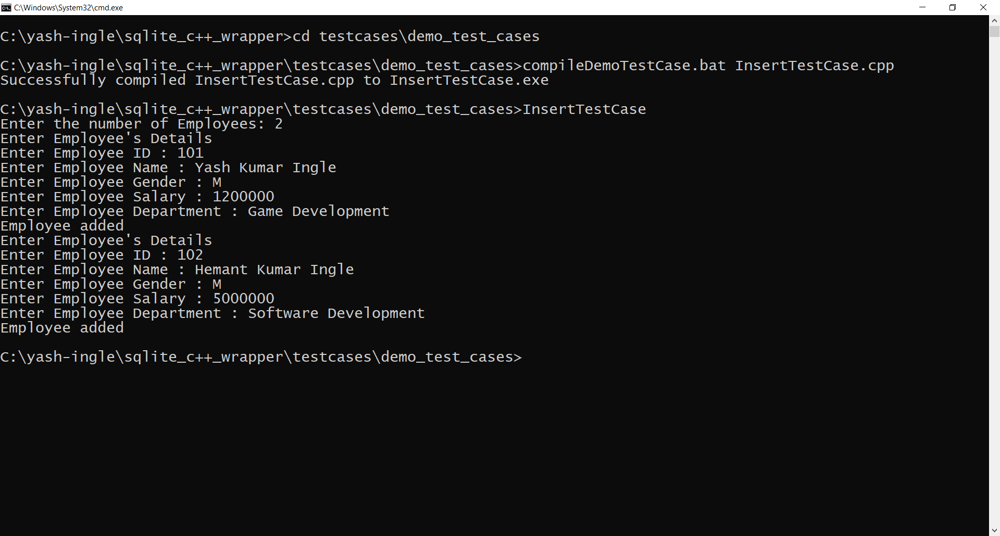
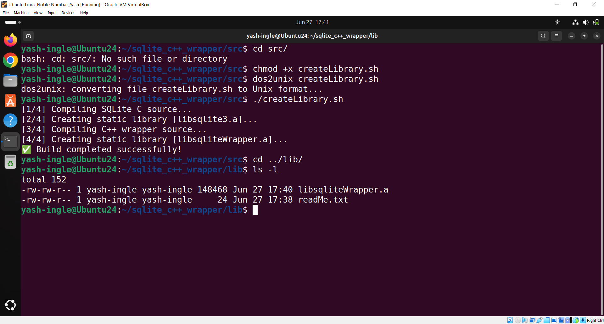
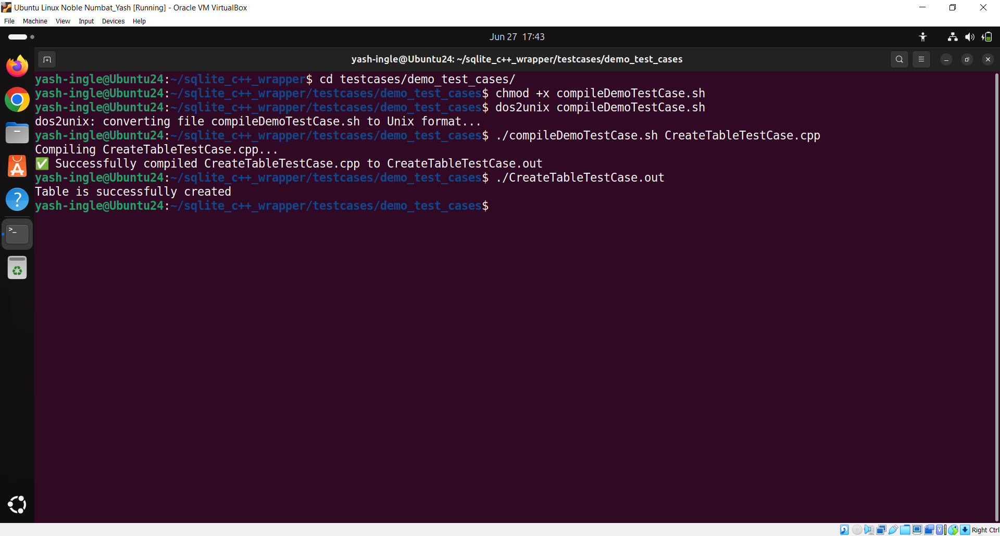
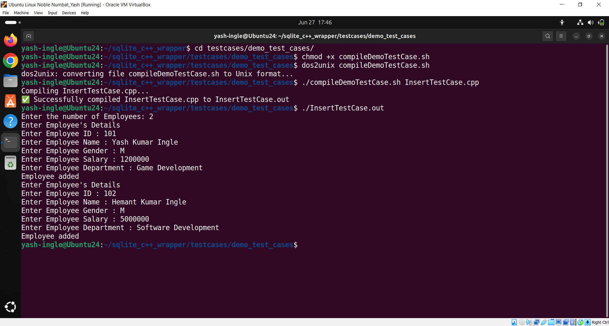
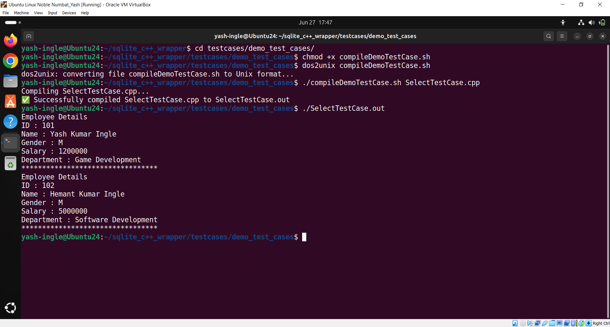
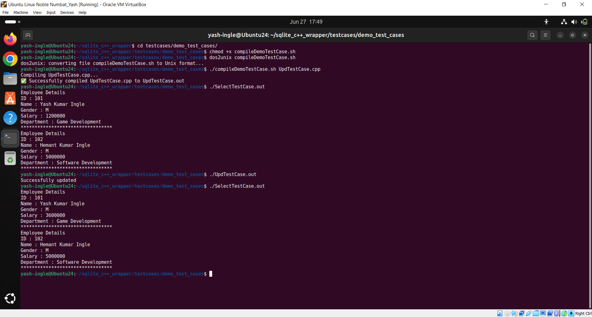
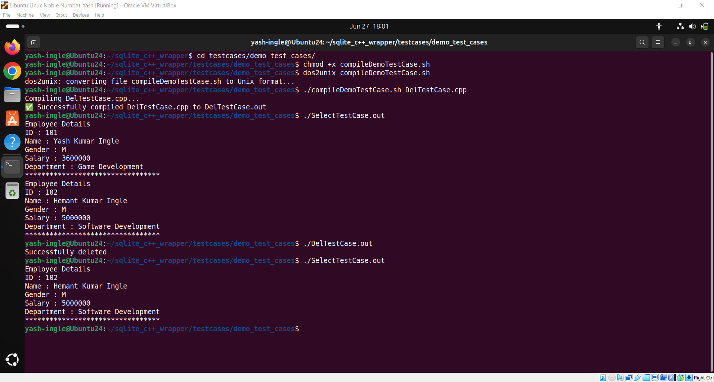

# SQLite C++ Wrapper
## Introduction to SQLite C++ Wrapper
Managing data efficiently is crucial for any software application, and SQLite is a popular choice for developers due to its lightweight and easy-to-use nature. However, working directly with SQLite's C API can be challenging, especially for C++ developers.

The SQLite C++ Wrapper is here to simplify that process. This library provides a straightforward and user-friendly interface for interacting with SQLite databases in C++. By wrapping the complexities of the SQLite API, it allows developers to focus on building their applications without getting lost in low-level details.

With features like automatic memory management and easy integration with C++ data types, the SQLite C++ Wrapper makes it easier than ever to work with databases. Whether you're creating a small project or a larger application, this wrapper will help you manage your data efficiently and effectively. Dive in and see how the SQLite C++ Wrapper can enhance your development experience!

## Requirements
1. Download and install a *C/C++ Compiler* compatible with your operating system.  
   Visit the website:  
   - [https://sourceforge.net/projects/mingw/](https://sourceforge.net/projects/mingw/)  
   - [https://www.mingw-w64.org/](https://www.mingw-w64.org/)

2. Download and install the *SQLite C Library* compatible with your operating system.  
   Visit the website:  
   - [https://sqlite.org/download.html](https://sqlite.org/download.html).

## How To Use SQLite C++ Wrapper
### For Windows User
**Setup**
1. Open command prompt and go to the `src` folder.
2. Run `createLibrary.bat`. (If everything is fine, it will generate `sqliteWrapper.lib` file)

**How to Run Demo Test Cases [Optional]**
1. Create Table.
   - Open command prompt and go to the `testcases\demo_test_cases` folder.
   - Run `compileDemoTestCase.bat CreateTableTestCase.cpp`.

2. Insert Data Into Table.
   - Open command prompt and go to the `testcases\demo_test_cases` folder.
   - Run `compileDemoTestCase.bat InsertTestCase.cpp`.

3. Retrieve Data From Table.
   - Open command prompt and go to the `testcases\demo_test_cases` folder.
   - Run `compileDemoTestCase.bat SelectTestCase.cpp`.

4. Update Data From Table.
   - Open command prompt and go to the `testcases\demo_test_cases` folder.
   - Run `compileDemoTestCase.bat UpdTestCase.cpp`.

5. Delete Data From Table.
   - Open command prompt and go to the `testcases\demo_test_cases` folder.
   - Run `compileDemoTestCase.bat DelTestCase.cpp`.

### For Linux User
**Setup**
1. Open terminal and go to the `src` folder.
2. Run `chmod +x createLibrary.sh` and `dos2unix createLibrary.sh`.
3. Run `./createLibrary.sh`. (If everything is fine, it will generate `libsqliteWrapper.a` file)

**How To Run Demo Test Cases [Optional]**
1. Create Table.
   - Open terminal and go to the `testcases/demo_test_cases` folder.
   - Run `chmod +x compileDemoTestCase.sh` and `dos2unix compileDemoTestCase.sh`. (Skip this, if previously done)
   - Run `./compileDemoTestCase.sh CreateTableTestCase.cpp`.
   - Run `./CreateTableTestCase.out`.

2. Insert Data Into Table.
   - Open terminal and go to the `testcases/demo_test_cases` folder.
   - Run `chmod +x compileDemoTestCase.sh` and `dos2unix compileDemoTestCase.sh`. (Skip this, if previously done)
   - Run `./compileDemoTestCase.sh InsertTestCase.cpp`.
   - Run `./InsertTestCase.out`.

3. Retrieve Data From Table.
   - Open terminal and go to the `testcases/demo_test_cases` folder.
   - Run `chmod +x compileDemoTestCase.sh` and `dos2unix compileDemoTestCase.sh`. (Skip this, if previously done)
   - Run `./compileDemoTestCase.sh SelectTestCase.cpp`.
   - Run `./SelectTestCase.out`.

4. Update Data From Table.
   - Open terminal and go to the `testcases/demo_test_cases` folder.
   - Run `chmod +x compileDemoTestCase.sh` and `dos2unix compileDemoTestCase.sh`. (Skip this, if previously done)
   - Run `./compileDemoTestCase.sh UpdTestCase.cpp`.
   - Run `./UpdTestCase.out`.

5. Delete Data From Table.
   - Open terminal and go to the `testcases/demo_test_cases` folder.
   - Run `chmod +x compileDemoTestCase.sh` and `dos2unix compileDemoTestCase.sh`. (Skip this, if previously done)
   - Run `./compileDemoTestCase.sh DelTestCase.cpp`.
   - Run `./DelTestCase.out`.

